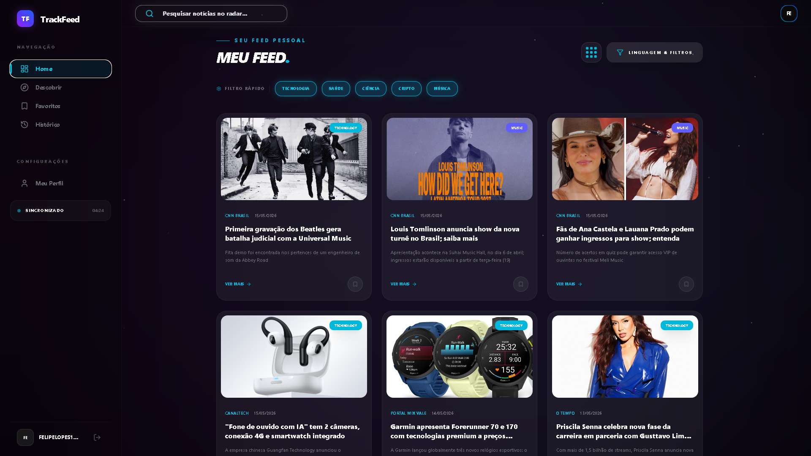
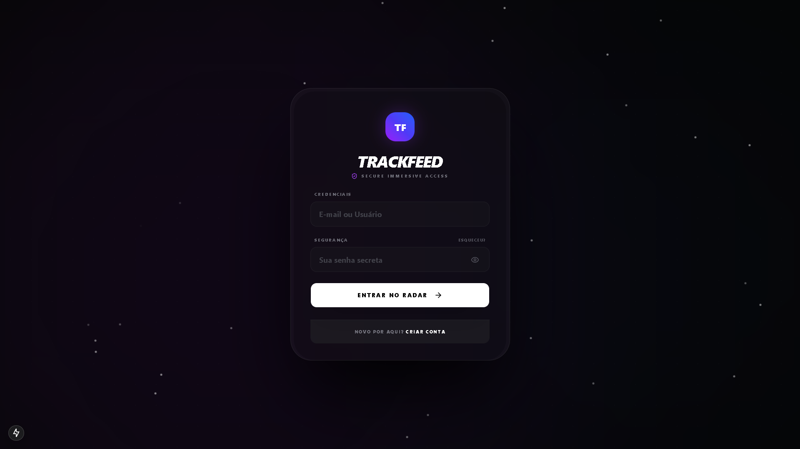
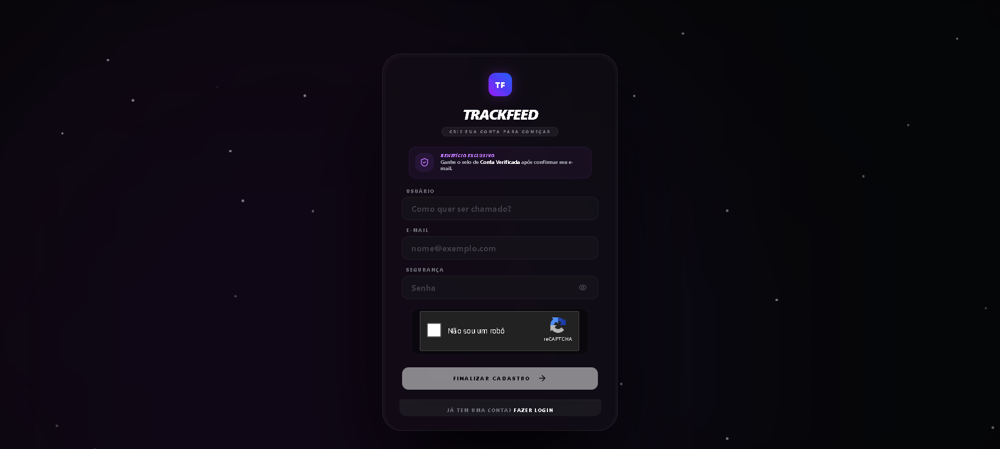
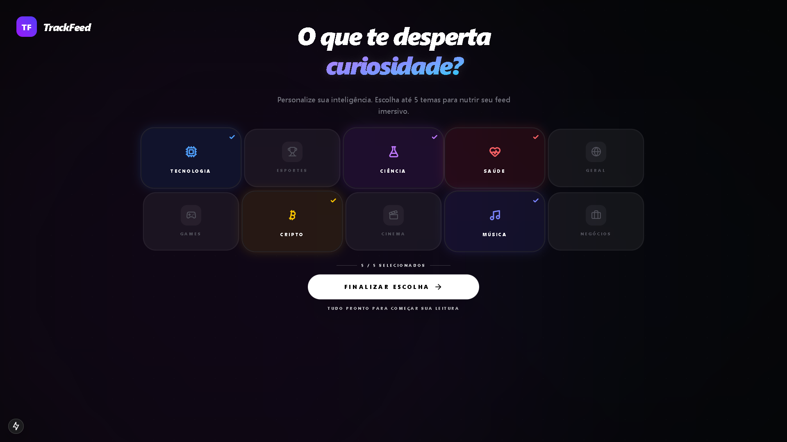
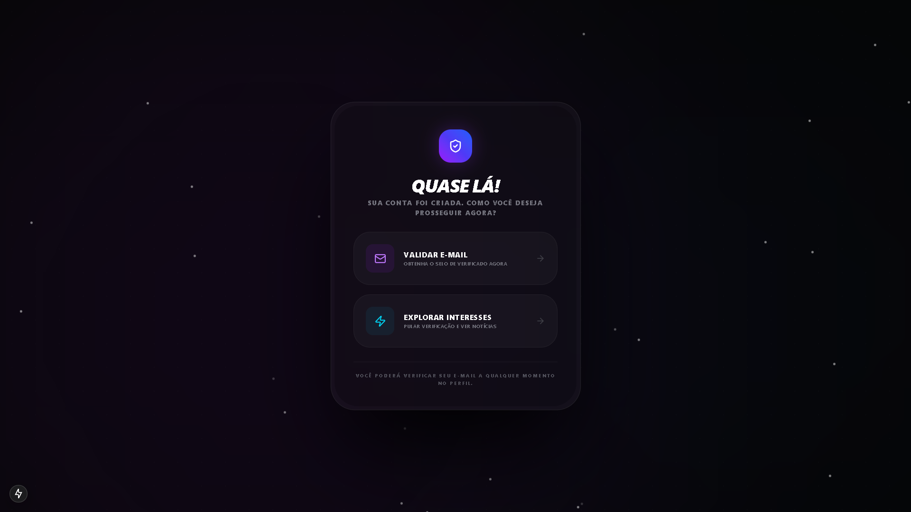
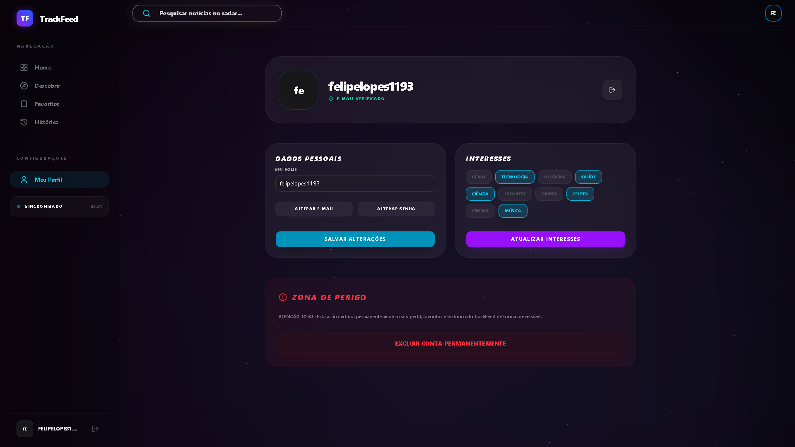

# TrackFeed

[](https://github.com/iambot1193/TrackFeed/actions/workflows/ci.yml)

Dashboard de notícias personalizadas: o usuário escolhe categorias de interesse e o feed busca, deduplica e categoriza notícias em tempo real a partir de três provedores (NewsAPI, GNews, The Guardian), com um passo extra de classificação por IA (Gemini) quando a categorização por palavra-chave fica em dúvida.

Construído como resposta a um desafio técnico da Trackland; o checklist original de critérios está em [`docs/desafio.md`](./docs/desafio.md).

> 🌐 **Deploy:** [trackfeed-inspo.vercel.app](https://trackfeed-inspo.vercel.app)
>
> ⚠️ Conta de teste disponível mediante cadastro próprio na tela de login. Não há conta pública compartilhada — sessão é um cookie assinado por usuário, então uma conta de demo pública seria trivialmente sequestrável por qualquer visitante.

---

## Capa



## Telas

| Login | Cadastro | Escolha de Interesses |
| :---: | :---: | :---: |
|  |  |  |

| Pós-Cadastro | Feed Principal | Perfil do Usuário |
| :---: | :---: | :---: |
|  |  |  |

---

## Funcionalidades

- **Categorização híbrida**: regras por palavra-chave/fonte primeiro; o que sobra como "general" vai em lote para o Gemini classificar.
- **Três modos de visualização** no dashboard: feed editorial (Home), descoberta (Explore) e favoritos.
- **Sessão de cookie assinado (HMAC)** — não é um `userId` cru, então não dá para forjar sessão de outro usuário trocando o valor do cookie. A expiração é validada no servidor e trocar a senha revoga as sessões antigas.
- **Verificação de e-mail por código de 6 dígitos**, com expiração de 10 minutos e limite de tentativas.
- **Histórico e favoritos** por usuário, com cache de artigos no banco para reduzir chamadas às APIs externas.

## Segurança

Decisões de segurança aplicadas, todas verificadas com um smoke test ponta a ponta e um pentest básico contra um Postgres local:

- **Sessão com cookie assinado (HMAC-SHA256)** — o valor carrega `userId`, versão da sessão e timestamp de emissão. Adulterar qualquer parte invalida a assinatura; um cookie assinado com outro segredo é rejeitado.
- **Expiração validada no servidor** — não se confia só no `maxAge` do navegador; um token com timestamp expirado é recusado mesmo que o cookie persista.
- **Revogação de sessão** — trocar a senha (no perfil ou via reset) incrementa `sessionVersion` e derruba as sessões antigas; a sessão atual é reemitida na hora.
- **Rate limit de login** — 5 falhas por identificador travam novas tentativas por 15 min. Persistido no banco (não em memória) porque a app roda serverless. Falhas são contadas tanto para usuário inexistente quanto para senha errada, evitando enumeração por comportamento.
- **Mensagens genéricas** — login e recuperação de senha não revelam se o e-mail existe.
- **Validação em todo trust boundary** — Server Actions revalidam nome, e-mail, senha e categorias com os mesmos schemas Zod do cadastro; e-mails são normalizados para minúsculas. Trocar o e-mail descarta qualquer código de verificação pendente (senão o código enviado ao endereço antigo validaria o novo).
- **SQL injection** — imune por design: todo acesso a dados passa pelo Prisma (queries parametrizadas), sem SQL cru.
- **XSS / mass assignment** — nome restrito a alfanumérico, avatar limitado a URLs http(s) e data URLs de imagem (SVG fora da whitelist); os campos de atualização de perfil são montados um a um, sem espalhar o input do cliente.
- **CSRF** — coberto pela verificação nativa de Origin das Server Actions do Next 15.
- **Cookie** — `httpOnly`, `sameSite=lax` e `secure` em produção.
- **Headers HTTP** — `X-Frame-Options: DENY` (anti-clickjacking), `X-Content-Type-Options: nosniff`, `Referrer-Policy` e `Permissions-Policy` em todas as rotas; `X-Powered-By` desativado.

## Stack

- **Framework**: [Next.js 16](https://nextjs.org/) (App Router, Server Actions)
- **Banco**: PostgreSQL via [Prisma ORM](https://www.prisma.io/) 7 (driver adapter `@prisma/adapter-pg`)
- **IA**: Google Gemini 2.0 Flash, usado só como fallback de classificação em lote
- **Estilização**: Tailwind CSS 4
- **E-mail transacional**: [Resend](https://resend.com/)
- **Fontes de notícia**: NewsAPI, GNews, The Guardian

---

## Rodando localmente

### 1. Instalar dependências
```bash
npm install
```

### 2. Configurar o `.env`
Copie `.env.example` para `.env` e preencha pelo menos a Seção A (`DATABASE_URL`, `SESSION_SECRET`, `GEMINI_API_KEY` e as chaves de notícia). A Seção B (Resend, reCAPTCHA, `NEXT_PUBLIC_APP_URL`) só é necessária para deploy em produção.

### 3. Sincronizar o schema com o banco
```bash
npx prisma db push
```
O projeto usa `db push` (sem histórico de migrations versionado) — é o fluxo mais direto para um banco de desenvolvimento/demo. Para um projeto com múltiplos ambientes e time, o caminho certo seria `prisma migrate dev`/`migrate deploy` com migrations no controle de versão.

### 4. Rodar
```bash
npm run dev
```
`http://localhost:3000`.

---

## Deploy (Vercel + Supabase)

1. **Banco**: crie um projeto Postgres no [Supabase](https://supabase.com/), copie a connection string e configure `DATABASE_URL`.
2. **E-mail (Resend)**: gere uma `RESEND_API_KEY`. Em conta gratuita/sandbox, a Resend só entrega para o e-mail cadastrado na própria conta — configure `RESEND_SANDBOX_EMAIL` apontando pra ele, ou verifique um domínio próprio para enviar a qualquer destinatário.
3. **reCAPTCHA v2**: registre um site em [google.com/recaptcha/admin](https://www.google.com/recaptcha/admin), adicione o domínio da Vercel, e configure `NEXT_PUBLIC_RECAPTCHA_SITE_KEY` + `RECAPTCHA_SECRET_KEY`. Sem essas chaves em produção, o login/cadastro recusa todas as tentativas (fail-closed, de propósito).
4. **`NEXT_PUBLIC_APP_URL`**: domínio público real (ex: `https://seu-app.vercel.app`) — usado nos links de e-mail de recuperação de senha.
5. **`SESSION_SECRET`**: valor aleatório forte (`openssl rand -base64 32`). Sem ele a aplicação não sobe — é o segredo que assina o cookie de sessão. Trocar esse valor invalida todas as sessões existentes.
6. **Sincronize o schema antes do primeiro deploy** (`npx prisma db push` apontando para o `DATABASE_URL` de produção). O schema inclui a coluna `sessionVersion`, usada na validação de sessão — sem ela, toda requisição autenticada falha.
7. Cadastre todas as variáveis acima em **Settings → Environment Variables** na Vercel e conecte o repositório.

---

Desenvolvido por Felipe Gonçalves.
