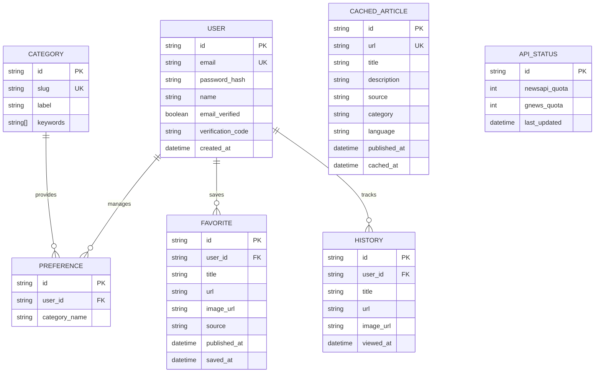

# Database Schema - TrackFeed

## Diagrama ER

## Detalhamento Adicional

### CachedArticle (O Cofre)
- Armazena os resultados das APIs externas (NewsAPI/GNews) e da Inteligência Artificial.
- Limpo automaticamente após 24 horas (`cleanupOldCache()`).
- Contém metadados de idioma (`language`) para segmentação internacional.

### ApiStatus (O Monitor)
- Singleton (Apenas 1 registro ativo de `id: "singleton"`).
- Deduz a cota das APIs em tempo real a cada requisição.

### Category
- Dicionário dinâmico que define os interesses disponíveis.
- Utilizado como dicionário-base para o Prompt do modelo de IA (Google Gemini).

## Detalhamento das Tabelas

### Users
- `id`: UUID ou Autoincrement (Chave Primária).
- `email`: E-mail único para login.
- `password_hash`: Senha criptografada.
- `name`: Nome de exibição do usuário.

### Preferences
- `id`: Chave Primária.
- `user_id`: Chave Estrangeira para Users.
- `category_name`: Nome da categoria (ex: technology, sports, business).

### Favorites
- `id`: Chave Primária.
- `user_id`: Chave Estrangeira para Users.
- `title`: Título da notícia.
- `url`: Link original.
- `source`: Fonte da notícia (ex: BBC, CNN).
- `published_at`: Data original de publicação.

### History
- `id`: Chave Primária.
- `user_id`: Chave Estrangeira para Users.
- `title`: Título da notícia.
- `url`: Link original.
- `viewed_at`: Timestamp da visualização.
