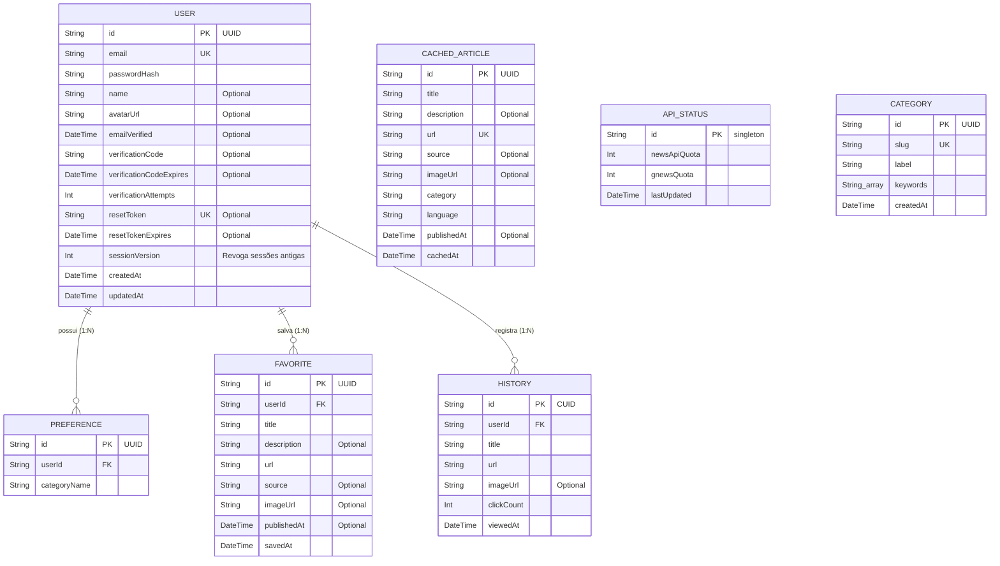

# 🗄️ Database Schema - TrackFeed

Este documento descreve a estrutura de dados oficial do **TrackFeed**, mapeada via **Prisma ORM** e hospedada em um banco de dados relacional **PostgreSQL** (Supabase).

---

## 📊 Diagrama de Entidade-Relacionamento (ER)

O diagrama abaixo ilustra os modelos e as relações de chaves estrangeiras entre eles:

---

## 🗂️ Detalhamento das Tabelas

### 1. `User` (Usuários)
Armazena a identidade, credenciais de acesso criptografadas e status de verificação de conta.

*   `id` (String, PK): Identificador único gerado automaticamente em formato **UUID**.
*   `email` (String, Unique): E-mail de cadastro usado para login.
*   `passwordHash` (String): Senha criptografada utilizando o algoritmo `bcrypt`.
*   `name` (String, Optional): Nome de exibição do usuário no dashboard.
*   `avatarUrl` (String, Optional): URL ou Base64 da foto de perfil.
*   `emailVerified` (DateTime, Optional): Data/Hora em que o e-mail foi validado. Se for `null`, a conta é considerada não verificada.
*   `verificationCode` (String, Optional): Código numérico temporário de 6 dígitos enviado para confirmação por e-mail.
*   `resetToken` (String, Unique, Optional): Token de segurança para redefinição de senha esquecida.
*   `resetTokenExpires` (DateTime, Optional): Data de expiração do token de redefinição de senha.
*   `createdAt` (DateTime): Timestamp de criação da conta.
*   `updatedAt` (DateTime): Timestamp da última modificação do perfil.

---

### 2. `Preference` (Interesses)
Mapeia os assuntos e categorias que o usuário selecionou para compor o seu Feed Pessoal.

*   `id` (String, PK): Identificador único em formato **UUID**.
*   `userId` (String, FK): ID do usuário associado (relação com `User.id` em cascata).
*   `categoryName` (String): Slug da categoria de interesse (ex: `technology`, `sports`).
*   *Restrição:* `@@unique([userId, categoryName])` garante que um usuário não duplique a mesma categoria de interesse.

---

### 3. `Favorite` (Artigos Salvos)
Artigos que o usuário favoritou para leitura posterior ou arquivamento.

*   `id` (String, PK): Identificador único em formato **UUID**.
*   `userId` (String, FK): ID do usuário que favoritou o artigo (relação com `User.id` em cascata).
*   `title` (String): Título do artigo.
*   `description` (String, Optional): Resumo ou subtítulo da notícia.
*   `url` (String): Link original completo da notícia.
*   `source` (String, Optional): Nome da fonte de notícias original (ex: `G1`, `TechCrunch`).
*   `imageUrl` (String, Optional): URL da imagem de destaque do artigo.
*   `publishedAt` (DateTime, Optional): Data original de publicação do artigo.
*   `savedAt` (DateTime): Data e hora em que foi favoritado.
*   *Restrição:* `@@unique([userId, url])` impede que o usuário favorite o mesmo link mais de uma vez.

---

### 4. `History` (Histórico de Leitura)
Logs de leitura do usuário, usados para gerar estatísticas personalizadas e para regras de exclusão no radar.

*   `id` (String, PK): Identificador único em formato **CUID** (otimizado para logs rápidos).
*   `userId` (String, FK): ID do usuário que leu o artigo (relação com `User.id` em cascata).
*   `title` (String): Título da notícia.
*   `url` (String): Link original da notícia.
*   `imageUrl` (String, Optional): Imagem da notícia lida.
*   `clickCount` (Int, Default 1): Número de vezes que o usuário clicou no artigo (usado para métricas de engajamento).
*   `viewedAt` (DateTime): Data e hora da leitura.

---

### 5. `CachedArticle` (Cofre Cache Local)
Banco de dados offline temporário que guarda artigos buscados de APIs externas e categorizados por Inteligência Artificial (Google Gemini) para garantir alta disponibilidade e economia de cotas.

*   `id` (String, PK): Identificador único em formato **UUID**.
*   `title` (String): Título do artigo.
*   `description` (String, Optional): Descrição ou resumo do artigo.
*   `url` (String, Unique): Link único da notícia.
*   `source` (String, Optional): Fonte original da notícia.
*   `imageUrl` (String, Optional): Imagem da notícia.
*   `category` (String): Categoria identificada (pelo algoritmo ou IA do Gemini).
*   `language` (String, Default "pt"): Idioma do artigo (ex: `pt`, `en`).
*   `publishedAt` (DateTime, Optional): Data original de publicação do artigo.
*   `cachedAt` (DateTime): Timestamp de gravação no cache.
*   *Índices:* `@@index([category, language])` e `@@index([publishedAt])` garantem consultas extremamente rápidas.

---

### 6. `ApiStatus` (Monitor de Cotas)
Registro único (Singleton) que controla os limites diários de consumo de requisições das APIs externas.

*   `id` (String, PK, Default "singleton"): ID fixo para garantir que exista apenas 1 linha de controle de cotas no banco inteiro.
*   `newsApiQuota` (Int, Default 100): Número de requisições restantes da NewsAPI.
*   `gnewsQuota` (Int, Default 100): Número de requisições restantes do GNews.
*   `lastUpdated` (DateTime): Data e hora da última alteração de status de cota.

---

### 7. `Category` (Dicionário de Categorias)
Assuntos disponíveis no sistema com as palavras-chave associadas usadas para fins de categorização.

*   `id` (String, PK): Identificador único em formato **UUID**.
*   `slug` (String, Unique): Identificador textual amigável da categoria (ex: `technology`).
*   `label` (String): Nome visual formatado da categoria (ex: `Tecnologia`).
*   `keywords` (String[]): Lista de termos associados que o algoritmo ou prompt de IA usam para identificar matérias correlatas.
*   `createdAt` (DateTime): Data de criação da categoria.
